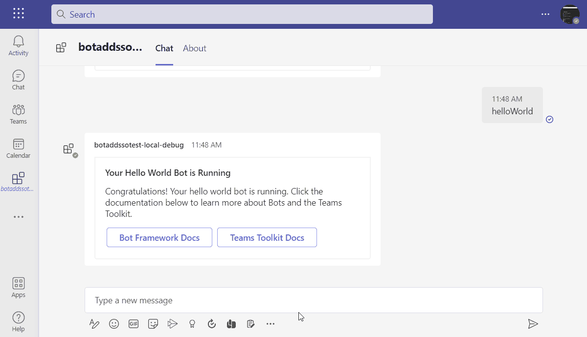

# Command Bot with SSO

Command Bot with SSO is a Microsoft Teams conversational bot that blends single sign-on (SSO), Microsoft Graph automation, adaptive cards, and proactive notifications. Commands are discovered at runtime, so dropping a new command file into `src/commands` instantly enables it in the bot. When a message is not handled by a command, the bot falls back to OpenAI to keep the conversation going.



---

## Highlights

- **Single Sign-On aware commands** – SSO-enabled commands receive a Microsoft Graph access token and can call protected APIs without prompting the user to log in again.
- **Productivity shortcuts** – Graph-backed commands cover calendar, tasks, presence, files, and profile scenarios that typically require switching between apps.
- **Dynamic command loader** – Commands are built as `new Command({...})` exports. They are picked up automatically at startup and exposed through `/help`.
- **Adaptive card templating** – Adaptive cards are stored in Postgres, hydrated at runtime via `AdaptiveCardBuilder`, and sent through the bot or via the `/api/notify` webhook.
- **Proactive notifications** – External systems can post to `/api/notify` to deliver cards to previously captured conversation references.

---

## Solution Architecture

```
┌───────────┐        ┌─────────────────────┐        ┌─────────────────┐
│ Microsoft │        │  Express / Bot API  │        │  Microsoft Graph│
│  Teams    │<------>│  src/index.ts       │<------>│  (SSO token)     │
└───────────┘        │   • TeamsAdapter    │        └─────────────────┘
      ▲              │   • ApplicationBuilder
      │              │   • MessageBus
      │              └─────────────┬───────────────┐
      │                            │               │
      │                    ┌────────────┐   ┌────────────┐
      │                    │ Commands   │   │ Adaptive   │
      │                    │ src/commands│  │ Cards + DB │
      │                    └────────────┘   └────────────┘
      │                                   Postgres (TypeORM)
      │
      └────────────── Proactive updates from /api/notify ───────────────►
```

- `src/index.ts` boots Express, configures `TeamsAdapter`, hosts the bot endpoint, and exposes `/api/messages` and `/api/notify`.
- `MessageBus` emits events to send adaptive cards and keeps proactive conversation references.
- Commands return bot activities or text. SSO commands receive a Graph token; others receive the conversation `TurnState`.
- `AdaptiveCardBuilder` reads card templates plus variable mappings from Postgres (via TypeORM) and renders a fully populated adaptive card for each event.
- `OpenAI` fills gaps when no explicit command handles the message.

---


## Prerequisites

| Requirement | Why it’s needed |
|-------------|-----------------|
| Node.js 18, 20, or 22 | Runtime for the bot (matching `engines` in `package.json`). |
| npm 9+ | Dependency management and script runner. |
| Microsoft 365 developer tenant | Allows sideloading the Teams bot and obtaining Graph consent. |
| Microsoft 365 Agents Toolkit (VS Code extension or CLI) | Provisioning, packaging, and debugging inside Teams. |
| Dev Tunnels (`devtunnel` CLI) or equivalent reverse proxy | Publishes your localhost to Teams during local development. |
| Azure subscription (optional) | Required only if you plan to provision Azure resources for production. |
| PostgreSQL instance | Stores adaptive card templates, vendor mappings, and event metadata. |

> If you already run inside Microsoft 365 Developer Sandbox, make sure the account you use has permissions to upload custom Teams apps and grant Graph permissions such as `User.Read`, `Tasks.ReadWrite`, `Calendars.Read`, `Presence.ReadWrite`, and `Files.Read`.

---

> **Database connection**  
> `src/internal/data-source.ts` contains the TypeORM configuration. Update it with your PostgreSQL host, port, username, password, and SSL requirements before running locally. In production we recommend loading these values from environment variables instead of keeping credentials in the codebase.

---

## Local Development

1. **Install dependencies**
   ```bash
   npm install
   ```
2. **Start Azurite (optional)** – required only if you rely on the local storage emulator.
   ```bash
   npm run prepare-storage:teamsfx
   ```
3. **Expose your bot to the internet** – Dev Tunnels example:
   ```bash
   devtunnel host -p 3978 --protocol http --allow-anonymous
   ```
   Update `BOT_DOMAIN` and `BOT_ENDPOINT` in your `.env` files with the values from the tunnel.
4. **Provision & deploy locally** (one-time per environment, using the Agents Toolkit CLI):
   ```bash
   atk provision --env local
   atk deploy --env local
   ```
   Or use the VS Code extension’s *Provision* and *Deploy* commands.
5. **Run the bot**
   ```bash
   # Starts nodemon + ts-node with inspector open on port 9239
   npm run dev
   ```
6. **Launch in Teams**
   - VS Code: press `F5` and choose *Debug in Teams (Edge/Chrome)*.  
   - CLI: `atk preview --env local`.

When the bot starts it logs to the terminal and prints which commands were discovered. Message activity, Graph calls, and TypeORM SQL traces appear in the same console for easy debugging.

---

## Deployment

The repository ships with the Teams app manifest under `appPackage/`. Update `resources/azure.parameters.json`, `infra/` templates, and `m365agents.yml` as needed for your environment.

Typical Azure deployment flow:

1. `atk auth login azure`
2. `atk provision --env dev` (creates Azure resources, Key Vault secrets, and updates the manifest)
3. `atk deploy --env dev`
4. `atk preview --env dev` to install the cloud-hosted bot in Microsoft Teams.

If you deploy outside of the Agents Toolkit, ensure that:
- All environment variables listed earlier are set in your hosting platform.
- Port 3978 (or the port you configure) is exposed.
- The `/api/messages` endpoint is registered in the Bot Channel Registration.

---

## Command Catalog

| Command | Requires SSO | What it does |
|---------|--------------|---------------|
| `help` | No | Lists available commands and highlights which ones require SSO. |
| `helloworld` | Yes | Sends an adaptive card confirming the bot is running. |
| `profile` | Yes | Returns the signed-in user’s display name, UPN, and job title. |
| `whoami` | Yes | Provides an expanded profile including department, manager, and contact info. |
| `nextmeeting` | Yes | Looks at the next calendar event within seven days and summarizes it. |
| `addevent` | Yes | Creates a sample calendar event (customize payload in `AddEvent.ts`). |
| `recentfiles` | Yes | Lists the three most recent OneDrive or SharePoint files. |
| `addtodo` | Yes | Creates a Microsoft To Do task and returns an adaptive card confirmation. |
| `tasksdue` | Yes | Shows up to three tasks due today from the default To Do list. |
| `setstatus` | Yes | Updates Teams presence (`setstatus busy PT30M`). |

You can add new commands by creating a file ending in `Command.ts` (or `Command.js` in the compiled output) that exports `new Command({ ... })`. The bot will load it automatically at startup—no manual registration required.

---

## Proactive Notifications

The `/api/notify` endpoint lets upstream systems push adaptive cards to users who previously interacted with the bot. Payload contract:

```jsonc
POST /api/notify
{
  "userId": "<AAD object id>",
  "eventId": 42,
  "data": { "any": "payload the adaptive card expects" }
}
```

Steps to use:

1. Make sure the target user has messaged the bot at least once so their `conversationReference` is cached.
2. Ensure `AdaptiveCardBuilder` can resolve the `eventId`. The event determines which template and variable mappings are used.
3. Send the request (from a trusted service) over HTTPS. The bot builds the card, uses `MessageBus` to send it, and replies with HTTP 200 on success.

Any errors encountered during build or send are logged to the console and returned as a 4xx/5xx response for easier diagnosis.

---

## Adaptive Cards, Vendors, and Templates

- Adaptive card JSON templates live both in the source tree (`src/adaptiveCards/`) and in Postgres tables via TypeORM entities such as `adaptiveCardTemplate`, `templateVariable`, `VendorResponseTemplateMapping`, and friends.
- `AdaptiveCardBuilder` orchestrates the process: it reads the event, maps response variables, substitutes them into the card template, and returns a rendered adaptive card ready to send.
- Use the `migrations/` folder to evolve the schema. Because `synchronize: true` is enabled for development, remember to turn it off and rely on migrations in production.

---

## Contributing & Next Steps

- Add automated tests (none are provided yet; the `test` script exits with status 1).
- Externalize database credentials into environment variables and secure stores.
- Expand the command catalog—for example, integrate SharePoint search, Power Automate triggers, or HR systems.
- Harden `/api/notify` by adding authentication (API keys, OAuth, etc.) before exposing it publicly.

---

## Additional Resources

- [Teams Bot documentation](https://learn.microsoft.com/microsoftteams/platform/bots/what-are-bots)
- [Microsoft 365 Agents Toolkit](https://aka.ms/teams-toolkit)
- [Microsoft Graph API reference](https://learn.microsoft.com/graph/api/overview)
- [Adaptive Cards designer](https://adaptivecards.io/designer/)

---

## License

This project inherits the MIT License defined in `package.json`. Review the terms before distributing or deploying the bot.
